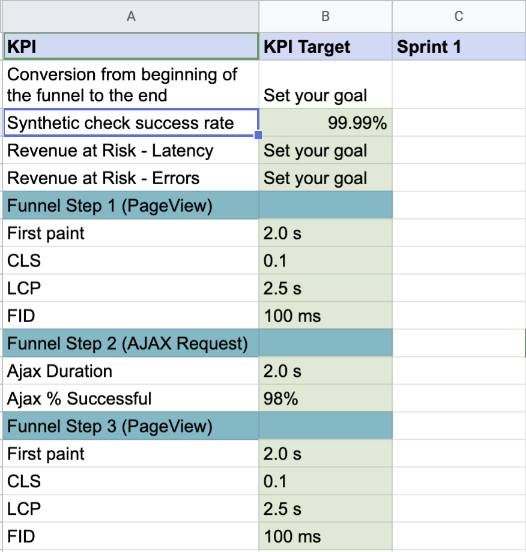

  
# Bottom of the funnel analysis

The bottom of the funnel analysis dashboard measures the user experience during the critical phase of the user's journey, which starts when the user passes a threshold indicating intent to complete an action.  For example, when a user goes to a cart and initiates checkout.   To implement the dashboard:
 
1. Follow the steps in the [implementation guide](https://docs.newrelic.com/docs/new-relic-solutions/observability-maturity/customer-experience/bofta-implementation-guide/#establish-current-state) to determine steps in the user journey that you will measure

2. Download the [dashboard json](botf.json). 

3. Edit botf.json and change ACCOUNT_ID to the account id that you will run most of the queries from.  Edit the filters.

4. Import the JSON as a new Dashboard via the main Dashboards menu.

5. Edit the imported dashboard 

# Dashboard organization

The dashboard is organized into sections.   The four widgets at the top make up the summary data.  Summary data includes the bottom of the funnel conversion rate, synthetics checks results, and revenue at risk.   

The performance of each step making up the bottom of the funnel follows below the summary data.  Performance data varies depending on the interaction type.  
* If the interaction is a PageView, you will capture Core Web Vitals and time to first byte.  
* If the interaction is an AjaxRequest, you will capture time to settle and http response code types (successes vs errors).

# Summary data queries
Edit the title tile to reflect the bottom of the funnel process shown in the dashboard.

## Conversion Funnel 
Update the Funnel query for your bottom of the funnel process
The structure of the funnel query is as follows:  
>FROM DATA_TYPE  
  SELECT funnel(COMMON_ATTRIBUTE, WHERE .. ACTION_A, .., WHERE .. ACTION_N)  
  SINCE 1 WEEK AGO  

COMMON_ATTRIBUTE - usually set to session.  You can capture conversions that happen over multiple sessions, by adding [custom attributes](https://docs.newrelic.com/docs/browser/new-relic-browser/browser-agent-spa-api/setcustomattribute-browser-agent-api/), like customerId, to Browser.  

WHERE … ACTION - filters for the PageViews or AjaxRequests relevant to that step in the user’s journey.  

__Examples__   
The following tracks conversions on the basis that a user converts in a single browser session (__PageViews__)
>FROM PageView SELECT funnel(session_id,  
      WHERE appName = ‘CustomerPortal’ and pageUrl like ‘%Checkout%’ AS ‘Begin Checkout’,  
      WHERE appName = ‘CustomerPortal’ and pageUrl like ‘%OrderConfirmed%’ AS ‘Order Confirmed’) 

The following tracks conversions on the basis that a user is authenticated by the time they begin checkout (__PageViews__)
>FROM PageView SELECT funnel(customerId,  
      WHERE appName = ‘CustomerPortal’ and pageUrl like ‘%Checkout%’ AS ‘Begin Checkout’,  
      WHERE appName = ‘CustomerPortal’ and pageUrl like ‘%OrderConfirmed%’ AS ‘Order Confirmed’) 

The same query as above but for a single page application (__AjaxRequests__)
>FROM AjaxRequest SELECT funnel(customerId,  
      WHERE appName = ‘CustomerPortal’ and requestUrl like ‘%Checkout%’ AS ‘Begin Checkout’ and httpResponseCode >= 200 and httpResponseCode < 300,  
      WHERE appName = ‘CustomerPortal’ and requestUrl like ‘%OrderConfirmed%’ AS ‘Order Confirmed’ and httpResponseCode >= 200 and httpResponseCode < 300) 

The funnel query pulls from a single data type. You won’t be able to combine PageViews and AjaxRequests in the same funnel.  If your bottom of the funnel flow includes a mix of PageViews and AjaxRequests you can capture the overall conversion rate by focusing on the PageViews at the start and the end.

## Synthetics Check
Change BOTF_MONITOR_NAME to match the synthetics monitor that validates the bottom of the funnel.  This is covered in the bottom of the funnel [implementation guide](https://docs.newrelic.com/docs/new-relic-solutions/observability-maturity/customer-experience/bofta-implementation-guide/#create-a-scripted-synthetics-check-for-the-bottom-of-the-funnel).

## Revenue at Risk - Latency
REVENUE_AT_RISK_LATENCY_FILTER - You can filter both related pages and Ajax Requests using pageUrl.  The [pageUrl value in an AjaxRequest](https://docs.newrelic.com/attribute-dictionary/?dataSource=Browser+agent&event=AjaxRequest&attributeSearch=pageUrl) reflects the page the user was on when they initiated the request.  

CONVERSION_VALUE - set this to what your organization considers the average value of a conversion.  Conversely, using custom attributes, you can change the query to be more specific and use the value of what the end user is about to purchase.   

For example, instead of  
>SELECT count(*) * 6.0 AS USD FROM PageView, AjaxRequest WHERE (pageUrl LIKE '%checkout%' or pageUrl LIKE '%confirmOrder%') AND (timeToSettle ..

where 6.0 is the average value of a conversion

You could use
>SELECT sum(cartValue) AS USD FROM PageView, AjaxRequest WHERE (pageUrl LIKE '%checkout%' or pageUrl LIKE '%confirmOrder%') AND (timeToSettle ..

provided that you have captured the cart value using [setCustomAttribute](https://docs.newrelic.com/docs/browser/new-relic-browser/browser-agent-spa-api/setcustomattribute-browser-agent-api/) or [setAttribute](https://docs.newrelic.com/docs/browser/new-relic-browser/browser-agent-spa-api/setattribute-browser-spa-api/).

One thing to be aware of is that in this example, the same cart value could be added multiple times if the same user experiences multiple interactions with slowness or errors.

## Revenue at Risk - Errors
REVENUE_AT_RISK_ERRORS_FILTER - This is likely to be the same as REVENUE_AT_RISK_LATENCY_FILTER

CONVERSION_VALUE - Revenue at Risk - Latency

# Bottom of the funnel queries

Edit, remove, or add data for each step in the bottom of the funnel

As stated in the bottom of the funnel [implementation guide](https://docs.newrelic.com/docs/new-relic-solutions/observability-maturity/customer-experience/bofta-implementation-guide/#distinguish-between-pages-and-actions) the bottom of the funnel is likely to be a mix of full page loads and Ajax requests.  The dashboard json shows an example of a flow that starts with a page load followed by an ajax request followed by a page load. 

For each step, edit the tile that calls out the step in the user journey.  This will help others understand and you remember which thing the user is doing.   Edit the title to match the user step rather than the page name or ajax request name.  

### Page performance tiles

The page performance tiles capture: 
first paint - time from user request to beginning of page render 
lcp - largest contentful paint - part of core web vitals. The time from beginning of page render to the largest contentful paint 
cls - cumulative layout shift - part of core web vitals.  A score indicating how much the layout shift changes during render 
fid - first input delay - part of core web vitals.  Recorded only when a user attempts to interact during render.  The time between user attempt and page response.  

To create a page performance row, edit the existing dashboard or add a new row.  The STEP.._FILTER value is there as a placeholder for the page filter.  This value is usually something like pageUrl LIKE %value%

### AJAX performance tiles

__Average Response Time__ 
* Uses Ajax metrics to measure average response times.  To find the correct entity guid and the metric name, use Data Explorer.  
* Select metrics
* Select the browser app associated with the Ajax call.  If the browser is instrumented via auto-injection, make sure you are using the browser app and not the apm app name. 
* Click on the _See timeslice metrics_ link
* Filter to Ajax.  Choose the Ajax response time. 
* Clicking on the Ajax metric will reveal the entity guid. 

__Success % Query__ 
* Uses AjaxRequest
* STEP2_AJAX_REQUEST_FILTER - Typically set to filter by web app name and the pageUrl that the AjaxRequest is invoked from

# Bottom of the Funnel KPI Measurement Instructions

The CustomerExperience_BotFAnalysis document provides a way to measure baselines and track progress while improving KPI performance.

1. Start with the format that works best for you, .ods, or .xls
2. Capture the current baseline.  Identify what needs improving and to what extent by highlighting it in yellow or red.  Highlight the rest in green.
3. Use other filters, as applicable, to identify other KPIs that need improving.  Capture only those that you plan to actively work on or measure.   Examples include KPIs filtered to mobile users where improvement is needed and impactful to the business.
4. Update KPI numbers weekly or after each sprint.  
5. Be aware of how long data is retained.  The KPI spreadsheet needs to be updated before retention of relevant data expires.
 

 